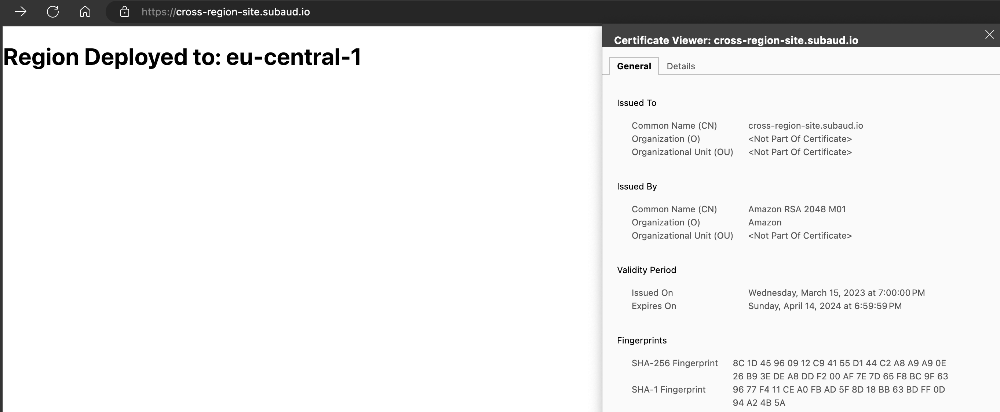

# Deploying Cross-Region Certificates with AWS Cloudfront via CDK

[AWS Certificate Manager](https://aws.amazon.com/certificate-manager/) (ACM) can be used to deploy TLS certificates for use with things like [Amazon Cloudfront](https://docs.aws.amazon.com/AmazonCloudFront/latest/DeveloperGuide/Introduction.html). However, ACM certificates must be deployed in `us-east-1`. In order to deploy an ACM certificate and associate with a resource outside of `us-east-1`, a multiple stack deployment must be used.

## Certificate Stack

The first stack to be deployed will be the `CertificateStack`. This stack will create a `Certificate` in the `us-east-1` region that can be used by a Cloudfront Distribution in another region.

```typescript
interface CertificateStackProps extends StackProps {
  siteSubdomain: string;
  domain: string;
  hostedZoneId: string;
}

export class CertificateStack extends Stack {
  siteCertificate: Certificate;
  constructor(scope: Construct, id: string, props: CertificateStackProps) {
    super(scope, id, props);

    const certificateResources = new CertificateResources(this, 'certificate', {
      siteSubdomain: props.siteSubdomain,
      domain: props.domain,
      hostedZoneId: props.hostedZoneId,
    });

    this.siteCertificate = certificateResources.siteCertificate;
  }
}

const app = new App();

const certEnv = {
  account: process.env.CDK_DEFAULT_ACCOUNT,
  region: 'us-east-1',
};

const certProps = {
  siteSubdomain: process.env.SITE_SUBDOMAIN || '',
  domain: process.env.DOMAIN || '',
  hostedZoneId: process.env.HOSTED_ZONE_ID || '',
};

const certStack = new CertificateStack(app, 'CertificateStack', {
  ...certProps,
  env: certEnv,
  crossRegionReferences: true,
});

app.synth();
```

Here we are explicitly declaring `us-east-1` as the region to deploy this `Stack` to because ACM certificates used with CloudFront _must_ use `us-east-1`. We are passing in to the `Stack` props from a `.env` file that will be used to create the `Certificate`. This `Certificate` will be used as input to the next `Stack`. Note that the `Stack` must take the input `crossRegionReferences: true` to let the next `Stack` use this `Certificate`.

## Site Stack

```typescript
interface SiteStackProps extends StackProps {
  siteCertificate: Certificate;
  siteSubdomain: string;
  domain: string;
  hostedZoneId: string;
}

export class SiteStack extends Stack {
  constructor(scope: Construct, id: string, props: SiteStackProps) {
    super(scope, id, props);

    const site = new SiteResources(this, 'site', {
      siteCertificate: props.siteCertificate,
      siteSubdomain: props.siteSubdomain,
      domain: props.domain,
      hostedZoneId: props.hostedZoneId,
    });

    new CfnOutput(this, 'distributionURL', {
      value: site.distribution.domainName,
    });

    new CfnOutput(this, 'siteUrl', {
      value: `https://${props.siteSubdomain}.${props.domain}`,
    });
  }
}

const app = new App();

const siteEnv = {
  account: process.env.CDK_DEFAULT_ACCOUNT,
  region: 'eu-central-1',
};

const siteProps = {
  siteCertificate: certStack.siteCertificate,
  siteSubdomain: process.env.SITE_SUBDOMAIN || '',
  domain: process.env.DOMAIN || '',
  hostedZoneId: process.env.HOSTED_ZONE_ID || '',
};

new SiteStack(app, 'SiteStack', {
  ...siteProps,
  env: siteEnv,
  crossRegionReferences: true,
});

app.synth();
```

Here we are creating a second `Stack` as part of this deployment. This `Stack` will deploy the actual website using the `Certificate` from the previous `Stack`. The props used for this `Stack` are the same as the previous `Stack` with the addition of the `Certificate` created in the first `Stack`. This `Stack` uses a typical Single-Page Application (SPA) deployment of S3 + CloudFront with a specific `Certificate` and `ARecord` assigned.

```typescript
this.siteBucket = new Bucket(this, 'websiteBucket', {
  publicReadAccess: false,
  removalPolicy: RemovalPolicy.DESTROY,
  autoDeleteObjects: true,
});

const hostedZone = HostedZone.fromHostedZoneAttributes(this, 'hostedZone', {
  zoneName: props.domain,
  hostedZoneId: props.hostedZoneId,
});

this.distribution = new Distribution(this, 'CloudfrontDistribution', {
  enableLogging: true,
  domainNames: [props.siteSubdomain + '.' + props.domain],
  certificate: props.siteCertificate,
  minimumProtocolVersion: SecurityPolicyProtocol.TLS_V1_2_2021,
  defaultBehavior: {
    origin: new S3Origin(this.siteBucket),
    viewerProtocolPolicy: ViewerProtocolPolicy.REDIRECT_TO_HTTPS,
    cachePolicy: CachePolicy.CACHING_DISABLED,
  },
  defaultRootObject: 'index.html',
});

new ARecord(this, 'clientSiteARecord', {
  zone: hostedZone,
  target: RecordTarget.fromAlias(new CloudFrontTarget(this.distribution)),
  recordName: props.siteSubdomain + '.' + props.domain,
});
```

The result will be an SPA deployed to S3 with a CloudFront Distribution that uses a specific URL from Route53 and a Certificate provided by ACM. This site can be deployed in any Region while the Certificate will be deployed in `us-east-1` as required by CloudFront.


## .env File

To deploy this demo, a `.env` file must be used. This `.env` file will contain the following:

```bash
SITE_SUBDOMAIN = 'cross-region-site'
DOMAIN = 'example.com'
HOSTED_ZONE_ID = 'Z00000000000000000000'
```

## Result



The result is an [SPA deployed](https://cross-region-site.subaud.io/) to a non `us-east-1` Region while still using an ACM Certificate used by CloudFront all deployed by CDK. Information on [cross-region certificates](https://docs.aws.amazon.com/cdk/api/v2/docs/aws-cdk-lib.aws_certificatemanager-readme.html#cross-region-certificates) is available on the AWS CDK Reference Documentation.
